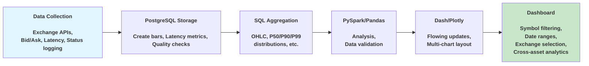

# ExchangeAgg

End-to-end analytics platform processing live cryptocurrency data across exchanges while using PySpark/Dash for analysis and data visualizations.

## Features

- PySpark ETL pipeline transforms live cryptocurrency quotes into OHLC bars and cross-exchange spread metrics
- P50/P90/P99 API latency tracking across exchanges + rolling last 5m summary stats table 
- HTTP error rate monitoring/logging
- Rolling regression residuals, spreads, and volatility forecasts computed via PySpark to power cross-exchange analytics
- Interactive dashboards built with Plotly Dash
- Data quality safeguards including ETL state management, duplicate detection, and comprehensive logging
- Modular design to support the easy addition of new exchanges or currency pairs
- Multiprocessing orchestrator (main.py) coordinating API data collection, Spark analytics, and Dash dashboards


## Architecture



## Quick Start (Local)
1. Clone the Repository
 ```bash
 git clone https://github.com/Chicago-tr/ExchangeAggregator.git
  ```
2. Install Dependencies
```bash
cd ExchangeAggregator
#Postgres
brew install postgresql@16
brew services start postgresql@16
createdb name_your_db

#Python deps
pip install -r python_service/requirements.txt

# TypeScript deps
cd typescript_service && npm install && cd ..
```
3. Set .env variables such as DB_URL and DB_NAME (.env.example lists whats needed)
   
4. Migrate database
```bash
npx drizzle-kit migrate
```

6. Run the platform
```bash
python main.py
```

## Screenshots


---

---


---

---


---

---


---

---


## Contributing
All contributions welcome, just fork the repo and open a pull request to ```main```.

